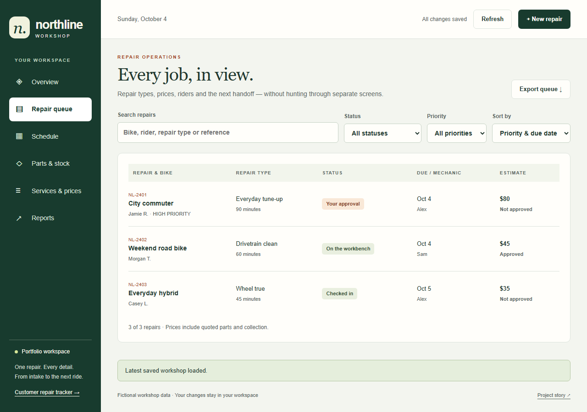

# Northline Workshop

[](https://github.com/SoleVagabond/northline-cycle/actions/workflows/checks.yml)

A working bicycle repair-management application with an original public website. An independent portfolio project for a fictional business, with persistent records, enforced business rules, failure recovery and a protected installation mode.

**[Open the workshop](https://northline-cycle-devin.netlify.app/workshop.html)** · [Public website](https://northline-cycle-devin.netlify.app) · [Project story](https://northline-cycle-devin.netlify.app/case-study.html) · [Operations guide](docs/OPERATIONS.md)

[Bike-shop business review](qa/BIKE-SHOP-REVIEW.md) documents the primary research, corrections and remaining operational limits. Starting prices are fictional; they are not validated local shop rates.

## Implemented application



- Six screens: overview, repair queue, schedule, parts and stock, services and prices, and reports.
- Twelve repair types with starting prices, explicit per-bike/wheel/brake scope and included work. No preset repair durations. Price edits affect new repairs; existing estimates retain their intake price. The website's six illustrated packages share the workshop's saved prices and records.
- Search by reference, bike, rider, repair type or mechanic. Filter by stage, priority or overdue status; sort by priority/planned work date, value or recent activity.
- Intake, mechanic assignment, planned work dates, separate expected collection dates and an earlier/later calendar. Optional job-specific bench budgets use a 480-minute planning ceiling; unknown budgets are shown separately. Prices never invent repair times. Business dates consistently use America/New_York.
- Inspected service charges and work descriptions, compatible part specifications, multi-part quantities, server-calculated totals, exact-version approval, retained decisions, declines, alternatives, cancellation and parts waits.
- Stock receipts, reservations, availability, consumption and a saved movement ledger. Competing repairs cannot reserve the same units. Insufficient stock pauses approved work until a receipt allows resumption.
- Safety checks before releasing repairs created or scheduled in the app. Only shifting can have a documented no-shifting exception; the other checks remain required. Earlier website repairs retain their original workflow until managed in the workshop.
- Notes, repair and estimate histories, printable summaries, CSV and JSON exports. Notes render as text; CSV cells protect against formula injection.
- Offline cash/card/bank payment records for money already received. Reports separate service value, recorded payments and outstanding balances. Recording a payment does not charge a card.
- Shared persistent records, conditional revision checks and duplicate-intake protection. Lost responses block writes until a refresh confirms the saved result.
- Protected local installation with an operator key, expiring HttpOnly sessions, sign-out, throttled sign-in and custom customer/bike intake. Private records survive logout and server restart.

## Try the complete workflow

1. Inspect all twelve repair types in Services & prices. Create a Brake service repair, assign a date/mechanic and start inspection.
2. Describe the inspected work, set its service charge to $60, and add one set of brake pads and two inner tubes with compatible specifications: **$109** without collection.
3. Use Customer view to approve the exact estimate. Return to Workshop view; stock is reserved or the job pauses for a shortage.
4. Complete work, record the applicable safety checks, mark ready, record an offline payment and collect the bike.
5. Reload, inspect estimate history, stock movements and Reports, then export the records.

The public deployment uses fictional data and separate visitor workspaces. Both workflow views are available to every visitor; they are not authenticated identities. Use fictional notes only. No client relationship, revenue or customer results are claimed.

## Run and install

Requires Node.js 22 or later. The core server uses Node's built-in modules:

```sh
npm start
```

Open **http://127.0.0.1:8788/workshop.html**. Without a key this runs portfolio mode. To enable a protected workshop in PowerShell 7:

```powershell
$env:NORTHLINE_OPERATOR_KEY = Read-Host 'Set a unique workshop key (16+ characters)' -MaskInput
npm start
```

Sign in on the workshop page to enter custom repair records. This mode has a stable workspace, up to 250 records and no seven-day portfolio expiry. New workspaces include three fictional examples. The operator records both workshop actions and communicated customer decisions; this is not a customer self-service portal or a staff permission system.

The server binds to loopback by default. The [operations guide](docs/OPERATIONS.md) explains storage, exact limits, backup/restore, key rotation, recovery and HTTPS proxy configuration. This Node installation is separate from the public Netlify deployment.

## Reproduce verification

```sh
npm ci
npm test
npm run typecheck
npm run format:check
npm run build
npx playwright install chromium firefox webkit
npm run test:browser
```

There are **77 isolated checks** and **29 browser journeys across five configurations**: desktop Chromium, Chromium at 375 and 320 pixels, desktop Firefox and desktop WebKit. Tests exercise inspected work and part specifications, separate work/collection dates, unknown bench budgets, multi-part approval, stock shortages/consumption, applicable safety checks, payment records, exports, printing, private sign-in, uncertain saves, competing tabs, persistence, keyboard controls and automated accessibility scans. No scan rules are suppressed. Emulated widths and browser engines do not establish physical-device support or complete accessibility conformance.

Tests start their own loopback server with fresh ignored data. Set `NORTHLINE_TEST_PORT` if port 8796 is occupied. Linux installations need `npx playwright install --with-deps chromium firefox webkit`. GitHub Actions runs the same suite and retains evidence for 14 days. The [QA report](qa/QA-REPORT.md) records actual release results; [the test plan](qa/TEST-PLAN.md) describes acceptance cases.

`node qa/verify.mjs http://127.0.0.1:8788` checks the unprotected local API. Add `--hosted` with the owned Netlify URL for production integration checks. This checker creates separate fictional workspaces.

## Architecture and product boundaries

Semantic HTML, CSS and browser JavaScript modules form the interface. Shared domain rules serve both Node and Netlify adapters. Local storage serializes transactions in one process and replaces JSON files atomically; run one process per data directory. Netlify uses strong reads and conditional Blobs writes (`onlyIfMatch`/`onlyIfNew`), rejecting stale revisions with 409. The local emulator's missing GET ETag has a development-only version fallback covered by adapter tests.

The public build exposes **25 allowlisted files** and excludes backend/authentication modules, package files and stored records. Validation and same-origin controls are implemented; these checks do not replace an independent security audit.

Portfolio mode permits ten repairs and seven-day expiry with bounded cleanup. Private mode permits 250 records. Both modes cap repairs at twelve estimate versions and 128 journal entries, and stock history at 200 movements. Limits preserve records and exports; plan archival storage or a fresh workspace before reaching them. Prices are whole USD values; dates use America/New_York; repair types, mechanics and parts are fixed source configuration.

The bounded repair workflow is implemented. External charging, deposits, tax accounting, emailed notifications, supplier purchasing, independently authenticated customers, staff permissions and multi-location administration are outside this version. Printed summaries are not tax invoices. [The competitor review](qa/COMPETITOR-REVIEW.md) identifies implemented capabilities and commercial gaps without claiming parity or hiring outcomes.

## Hosting

The owned production project is `northline-cycle-devin`. Run checks and build before deploying public output and functions to that existing project. Production uses site-wide Blobs; previews use deploy-scoped storage. `netlify.toml` configures API routing, headers, the 60-request/minute IP/domain rule and hourly cleanup. Rate limiting is not a spending cap. The cleanup schedule is configured; actual scheduled execution has not been observed in this review.

Older screenshots and QA sections are historical. The checked-in suite regenerates evidence for the current application.
