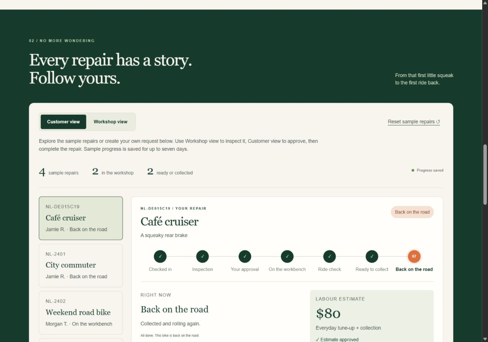
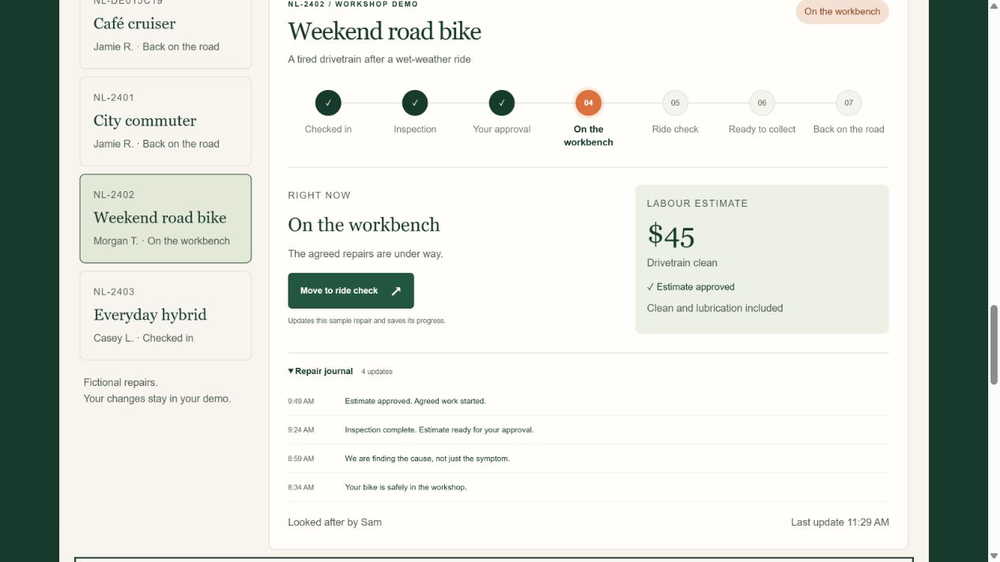
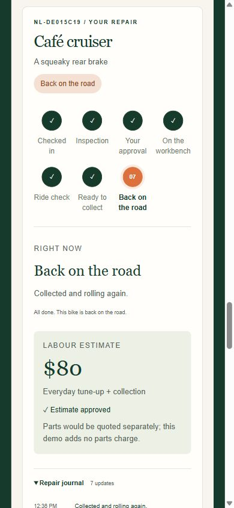
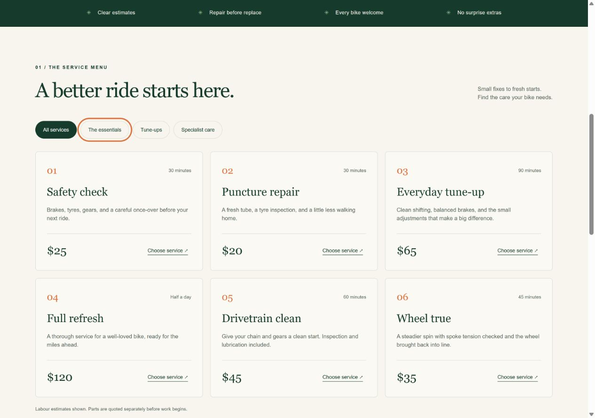
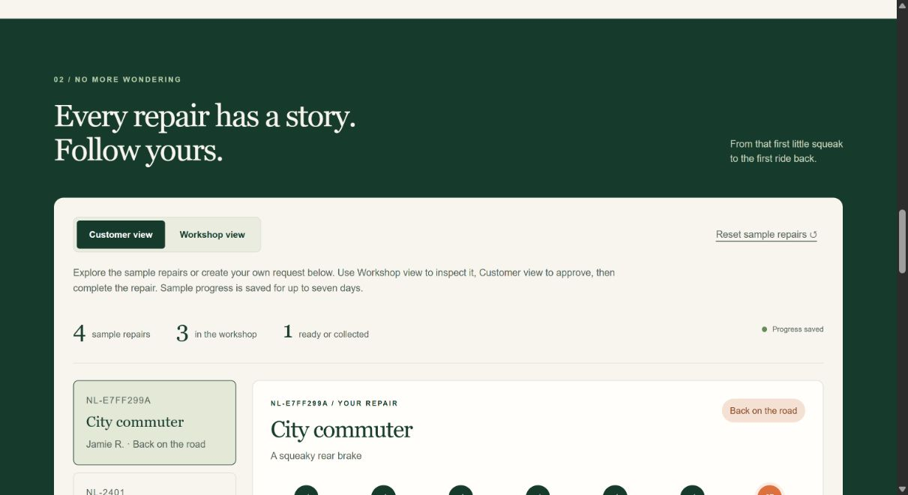

# Northline Workshop — release evidence

## October 5 customer records and work orders release

The release plan connects configurable services, SKUs, shop hours and staff availability to saved customer/bike history, itemized work orders, scoped customer approval links and persistent repair photos. Inspection and internal notes remain separate from explicitly shared updates and images. Existing repairs keep their estimates and history.

**Local verification:** All **94 isolated checks** passed. The full browser run passed 164 of 165 scenarios before Firefox exposed an invalid PNG test fixture. The fixture was corrected and PNG integrity validation was strengthened; all **20 affected scenarios** then passed across desktop Chromium, 375/320-pixel Chromium, Firefox and WebKit. Following the final returning-bike intake refinement, all **10 affected intake scenarios** passed again. Accessibility scans suppress no rules. Formatting, type checking and the 30-file public build passed.

All **24 existing local integration checks** and **8 new work-order integration checks** passed. The latter cover repeat-bike history, a $142.45 itemized estimate, private/shared photo access, a separate customer approval, stock shortage and receipt, quality checks, payment recording, collection and link revocation. The in-app browser separately saved and approved a $115.60 estimate comprising one $35.10 wheel service and two $40.25 brake services; refreshing the workshop showed the repair on the workbench.

Reassessment simplified the repair detail into disclosures, hid unselected part specifications, preselected newly created customer records, clarified shortage quantities and corrected stale decision recovery. Changes to shop or staff availability flag existing scheduling conflicts rather than moving jobs silently. Further manual review standardized cents in future journal entries. See the release plan for the complete acceptance criteria and refinements.

Links confer access to one repair; they do not verify a customer's identity. Contacts are not messaged automatically. Photos are separately stored and included in full file backups, while exports contain photo metadata only. Payment entries do not charge cards. Tax, purchasing, staff accounts and commercial integrations remain outside this release.

[Release plan](../docs/WORK-ORDER-RELEASE.md) · [Work-order integration output](evidence/work-orders-local-smoke.txt) · [Operations guide](../docs/OPERATIONS.md)

## October 4 bicycle-shop business correction

The [business review](BIKE-SHOP-REVIEW.md) uses bike-shop service menus, workshop software documentation and manufacturer-compatible part guidance. It replaces catalog durations and repeated labour labels with scoped starting prices, separates internal work scheduling from expected collection, requires descriptions of inspected work and compatible part specifications, and permits a documented no-shifting exception while retaining the other safety checks. Quote values and past approvals remain unchanged. Generic sample stock is no longer represented as universal compatible SKUs.

**Local verification:** All **77 isolated checks** passed, including nine new business-rule checks. All **145 browser scenarios** passed across desktop Chromium, 375/320-pixel Chromium, Firefox and WebKit. After the final form styling and rescheduling validation, all **25 affected browser scenarios** passed again. These include quote editing, keyboard navigation, separate customer dates, all six screens, narrow-width layout and accessibility scans with no suppressed rules. Formatting, type checking and the 25-file public build passed. All **24 local integration checks** passed, including an inspected $109 quote, recorded compatible specifications, job-specific budget and distinct collection expectation.

The initial desktop check found that the populated work-description textarea did not expose the intended accessible name. The explicit name was corrected and the full suite passed. The current queue image was regenerated from a successful browser check. Research does not validate the fictional rates, productive staff availability or commercial readiness; those limits are explicit in the review and operations guide. Older release sections below are historical, including the superseded automatic fitting-time assumption.

[Business review](BIKE-SHOP-REVIEW.md) · [Local integration output](evidence/product-local-smoke.txt) · [Operations guide](../docs/OPERATIONS.md)

**Published verification:** [GitHub run 37254906856](https://github.com/SoleVagabond/northline-cycle/actions/runs/37254906856) passed formatting, all **77 isolated checks**, type checking, the 25-file build and all **145 browser scenarios** from the published application commit `af4d7e3271d038055514c1cc7abe7a9836ea1de7`. Netlify deploy `6ac309472726cf15f3a32225` reached ready state, and all **24 hosted integration checks** passed. [Hosted output](evidence/product-hosted-smoke.txt).

The in-app browser separately saved an inspected $80 quote ($55 service charge plus specified $25 pads), received its approval, and retained the independently entered October 5 work date, 105-minute internal budget and October 8 collection expectation. Customer view omitted the internal budget. A fresh production navigation retained all five earlier repairs, their stages and $125/$80/$80/$45/$35 estimates. The live catalog displayed all twelve scoped starting prices without preset durations. Only fictional data was used; no real charge or customer message occurred.

Following verification, a documentation-only correction refreshed the project story's sample quote instructions and README test counts. The tested application JavaScript and business rules are unchanged.

## October 4 workshop application release

**Project:** Independent application for a fictional bicycle business.

The application now connects twelve repair types and editable prices to an operational queue, mechanic scheduling, inventory, quality checks, offline payment records and reports. Protected Node mode adds operator sign-in, custom intake and persistent records without portfolio expiry. The public deployment retains visitor workspaces and openly accessible workflow views.

**Local results:** 68 isolated domain/server checks passed. The expanded browser run passed 134 of 135 scenarios before discovering that Windows WebKit skips ordinary links with its default Tab behavior. Giving the skip link explicit keyboard participation corrected the remaining case. The keyboard and all-six-screen layout/accessibility checks then passed again across all five configurations (10 checks). The complete 135-scenario suite is also run by GitHub for the release. No scan rules were suppressed.

The checks cover 27 journeys in desktop Chromium, 375/320-pixel Chromium, desktop Firefox and desktop WebKit. Eight new journeys verify priced intake, scheduling, multi-part approval/reservation, stock consumption and shortages, quality gates, offline payment/collection, catalog edits across the website, search and priorities, CSV/JSON exports, print content, text-safe notes, lost stock responses, all screen layouts and protected custom intake across sign-out.

The first review caught implicit select labels with ambiguous accessible names, footer contrast inherited from the website stylesheet and an order-dependent calendar assertion. Labels and contrast were corrected; the calendar assertion now checks job membership. A private browser fixture also completed its user journey but hung on an idle connection during teardown; its own connections are closed explicitly. No business assertions were removed.

Further review corrected midnight scheduling, added fitting labour to capacity checks, kept one service active, synchronized website prices after catalog edits, and covered exact HTTPS origin validation behind a private proxy. Local formatting, type checking and the 25-file public build passed. All **24 local API integration checks** passed, including the new $109 multi-part repair through approved reservations, consumed stock, required checks, recorded payment and collection.

[Local integration output](evidence/product-local-smoke.txt) · [Acceptance plan](TEST-PLAN.md) · [Operations guide](../docs/OPERATIONS.md) · [Competitor comparison](COMPETITOR-REVIEW.md)

Protected sessions, restart persistence and backup instructions do not establish a remotely deployed private service. Public tests use fictional records. Payments are offline records; no external charge is made. Browser engines and viewport checks do not establish physical-device compatibility or full accessibility/security/load certification. Commercial identities, messaging, purchasing and tax accounting remain outside this release. Earlier sections below describe historical releases.

**Published verification:** [GitHub run 37251266596](https://github.com/SoleVagabond/northline-cycle/actions/runs/37251266596) independently passed formatting, all 68 isolated checks, type checking, the 25-file build and all **135 browser scenarios** in a fresh Linux checkout. The live production app passed all **24 hosted integration checks**, including the $109 multi-part repair, reservations, consumption, four-check release, payment record, collection and reload. [Hosted output](evidence/product-hosted-smoke.txt).

The in-app browser separately completed a new local Brake service repair at $109, with two quote versions, all four checks, recorded cash payment and collection. A fresh page load retained thirteen journal updates. A fresh production navigation preserved all five earlier repairs, including three collected records; the published Services & prices screen exposes all twelve types. No real charge or customer communication occurred.

## October 4 repair-decision update

The new release passed **48 isolated checks and 57 browser scenarios**. Five added journeys cover revised estimates with approval and parts-wait/collection, customer declines and alternatives, confirmed/dismissed cancellation, a lost revision response after the real save, and expanded-editor/exception-state layout and accessibility. They run at the same desktop and two narrow widths. No accessibility rules were suppressed.

All **17 local and 17 production integration checks** passed, including repricing already-approved work, refusal of an old estimate version, a declined $125 offer replaced by an approved $92 offer, saved parts-wait/resume, and terminal cancellation. The local in-app browser also completed the decline/alternative, parts-wait/resume, ride-check and collection journey; navigation retained all three estimate versions and twelve journal entries. A fresh production navigation loaded the new controls and retained both previously collected browser samples. [Current hosted check output](evidence/hosted-smoke-checks.txt).

The production in-app browser revised original sample NL-2401 from $80 to $125, approved the new version, paused for parts, resumed at the workbench, passed the ride check, and recorded collection. A fresh navigation retained both quote versions and ten journal entries. A final wording pass replaced duplicated parts-wait text with an explanation that the existing approval remains valid; the three corresponding browser journeys passed again.

[GitHub verification](https://github.com/SoleVagabond/northline-cycle/actions/runs/37246270692) independently passed formatting, all 48 isolated checks, type checking, the public build, and all 57 browser scenarios in a fresh Linux checkout.

The server calculates parts/labour from a controlled sample catalogue, preserves quote versions, and requires approval of the exact current version. Revising an already approved job clears its current approval and pauses work. Earlier approvals remain historical decisions. Declines can lead to a new alternative; cancellation is terminal. Waiting for parts retains the approved version and resumes at the workbench. API checks reject forged totals and personal notes, stale workspace writes, incorrect role actions, and approval of an old quote. Tests also verify compatibility with saved repairs from the previous release and bounded quote/journal growth.

The [competitor review](COMPETITOR-REVIEW.md) cites current vendor documentation, identifies comparable workflow concepts, and records the remaining commercial-product gaps. It is a documentation comparison, not hands-on testing of those products or a hiring-outcome claim.

## October 4 workflow review

The updated interface passed **32 isolated tests, 42 browser scenarios, and 12 local integration checks**. Fourteen browser scenarios run at 1280×900, 375×812, and 320×740. The desktop in-app browser also completed inspection, customer approval, repair, ride check, readiness, and collection; navigation retained the collected repair.

The review found approval wording before inspection, combined ready/collected counts, and view switching far from the next action. The interface now labels who acts next, provides inline view handoffs that preserve the repair and stage, breaks the estimate into labour/collection, and offers separate approval/ready/collected filters with recoverable empty results. Reset is inside Demo options.

Unconfirmed actions and resets now show uncertain progress and block further repair actions until a reload. The reset message previously promised old progress remained even when its response was lost after a successful reset. The regression performs the actual reset, discards its response, and verifies that recovery shows the fresh saved workspace. Other added cases cover service-menu recovery with retained choices, pending-request controls, and view/filter behavior. Automated accessibility scans still pass without suppressed rules.

The local Windows test run required ending its isolated test-server process during cleanup before reporting all 42 passes. GitHub repeats the suite in a fresh Linux checkout. Screenshots elsewhere in this report document earlier releases. These checks are an engineering review, not an independent usability study or a complete accessibility audit.

The [GitHub browser job](https://github.com/SoleVagabond/northline-cycle/actions/runs/37243846155/job/111557717050) independently passed all 42 scenarios. The accompanying formatting job found one case-study line-wrap issue; it was corrected before the final source update.

The [corrected full workflow](https://github.com/SoleVagabond/northline-cycle/actions/runs/37244059608) passed formatting, all 32 isolated tests, type checking, the public build, and all 42 browser scenarios. A final visual review changed the four mobile repair filters to a two-by-two layout and enlarged their labels; the desktop and both narrow layout/accessibility scenarios passed again. The project-level promotional badge was disabled in Netlify configuration and its absence verified on a fresh live navigation.

The October 4 production update passed all 12 hosted integration checks. A browser navigation retained the previously collected City commuter and its saved journal, alongside the original samples. The deployment includes both API and cleanup functions, the existing rate rule, and the hourly schedule; this review did not establish actual scheduled execution.

## Repeatable browser verification from the previous release

The expanded [GitHub check](https://github.com/SoleVagabond/northline-cycle/actions/runs/37176343156), commit `5704260`, passed all **32 isolated checks and 24 browser scenarios**. Browser checks run the actual loopback application at 1280×900, 375×812, and 320×740 without a framing proxy. Each run has fresh sample storage.

Eight scenarios cover the complete seven-stage journey and reload, a response lost after the real save, competing tabs, conflict plus failed refresh, separate visitors, failed startup recovery, keyboard focus, and layout/accessibility in approval and repairing states. A lost-response retry reused the same request reference and left exactly four repairs; a conflicting tab reloaded the saved inspection without skipping to approval.

The first scan found low contrast in orange text, the stamp, and repair-stage labels. The accent and muted labels were darkened; the full suite then passed without disabling scan rules. The skip link now focuses main content, and the labelled workshop-principles container has an explicit group role.

The [browser evidence artifact](https://github.com/SoleVagabond/northline-cycle/actions/runs/37176343156/artifacts/11293316735) contains screenshots, accessibility JSON, and an HTML report. It expires October 18, 2026; the checked-in suite regenerates the evidence. Automated scans and emulated Chromium viewports do not establish full accessibility or device/browser compatibility.

## Previous local and hosted verification

Everyday tune-up costs $65 in this fictional catalogue; collection raises the estimate to $80. The public form accepts controlled choices and a fixed fictional rider, rejecting personal fields and free-text notes. A saved request creates a repair in the same visitor workspace and returns its tracking reference.

A browser-created Café cruiser repair advanced through all seven stages: check-in, inspection, approval, work, ride check, readiness, and collection. Approval required Customer view; other steps used Workshop view. Reload retained the collected repair and its seven journal entries. The smoke checker repeats this journey through the hosting function and storage emulator.

Retrying a saved request returned its existing repair without a duplicate. Tests also cover the ten-repair limit, seven-day expiry, session renewal, cleanup with a saved scan cursor, visitor separation, failed saves, and conditional updates.

## Observed defect QA-04 — failed refresh implied current progress had loaded

**Priority:** Medium  
**Status:** Corrected and retested

**Reproduce:** Return 409 for a tracker action, then 503 for the following refresh.

**Expected:** Explain that the update conflicted and the newest progress could not load. Offer recovery without claiming the displayed state is current.

**Actual:** The previous message could say newer progress had loaded even after the refresh failed.

**Correction:** Return an explicit refresh result and choose messaging from that result. Show an enabled **Reload saved progress** control. Lost-response messaging also explains that an update may already have saved.

**Retest:** A local proxy returned actual 409 and 503 responses. The browser displayed: “This repair changed, but the latest progress could not load. Reload saved progress before trying again.” The reload control was enabled.

## Responsive and keyboard checks

Document widths measured 375 pixels in a 390-pixel frame and 753 in a 768-pixel frame, with no document-level horizontal overflow. The current narrow tracker shows readable stage labels, a wrapping timeline, the $80 estimate, approval state, and journal. Earlier keyboard checks verified filter activation and retained focus after repair selection.

Responsive checks used isolated same-origin frames because the narrow viewport override did not apply reliably. A QA-only proxy allowed framing; the app retains its `frame-ancestors 'none'` policy. These are Chromium rendering checks, not physical-device or cross-browser claims.

## Earlier defects retained as development history

### QA-01 — focus outline on unfocused buttons

An early selector began with `button,` instead of `button:focus-visible,`, giving every button an outline. Retesting the correction found no outline on an unfocused filter; Tab produced visible focus and Space selected its category.

### QA-02 — split-packet UTF-8 corruption

The early parser decoded each network chunk independently. Splitting the two bytes of `ë` in the then-supported fictional name `Zoë Rider` produced replacement characters. The fix collects bounded bytes and decodes UTF-8 once before parsing. The current regression uses the approved `café` bike choice and verifies Café cruiser survives split writes. The released form no longer accepts names or free-text notes.

### QA-03 — local hosting refused an approval

Netlify Blobs SDK 11.1.3's emulator omitted the GET ETag, so the adapter refused an update with 503. Local development now brackets a fresh read with matching list versions. A changing version remains an error. Hosted requests still require standard ETags and conditional writes.

All 12 smoke checks passed through Netlify Dev, including saved approval and stale-update rejection. Adapter tests cover stable/changing emulator versions and competing conditional writes. Emulator results do not establish distributed-storage guarantees.

Earlier enquiry screenshots remain historical evidence of the former form and its real storage-failure response. They do not describe the released form.

## Automated verification

- **32 isolated tests passed**, with no failures or skips.
- **12 smoke checks passed** against the plain server and **12 passed** through Netlify Dev and its Blobs emulator.
- Formatting, type checking, public-file preparation, and hosting-function compilation passed.
- The compiled API manifest includes `/api/*` and the 60-request/minute IP/domain rate rule. Cleanup is configured hourly.
- The app dependency audit reported zero findings. The separate deployment CLI retains upstream advisories documented in the project README.

[Automated test output](evidence/automated-tests.txt) · [Local smoke output](evidence/smoke-checks.txt) · [Hosting smoke output](evidence/hosting-smoke-checks.txt)

## Remaining limits

This creates fictional repairs and demonstrates workflow views available to every visitor. It does not authenticate users, send email, book appointments, or take payment. No complete accessibility, security, load, or cross-browser audit was performed. Expiry blocks access after seven days; deletion follows bounded cleanup. Rate limiting is not a spending cap. Public hosting requires separate checks, and configured scheduling alone does not prove execution.

## Deliverable

One working website with a supporting QA study: original illustrations, a connected repair workflow, source and hosting configuration, four observed defects with corrections, scoped evidence, and reproducible checks. No client relationship or commercial results are claimed.

## Hosted verification

[Live demo](https://northline-cycle-devin.netlify.app) · [Project story](https://northline-cycle-devin.netlify.app/case-study.html)

All 12 checks passed against production, including request persistence, all seven stages, reload, duplicate prevention, rejected personal fields, stale-update rejection, and private-file protection. The production manifest confirms both functions, the API rate rule, and the hourly cleanup schedule. No scheduled invocation has yet been observed.

[Hosted smoke output](evidence/hosted-smoke-checks.txt)

The browser-created City commuter repair also reached collection. A fresh navigation after the final deployment retained its seven journal entries, confirming that production workspace storage survives a new release.

[Published function and schedule configuration](evidence/hosting-config.json)
